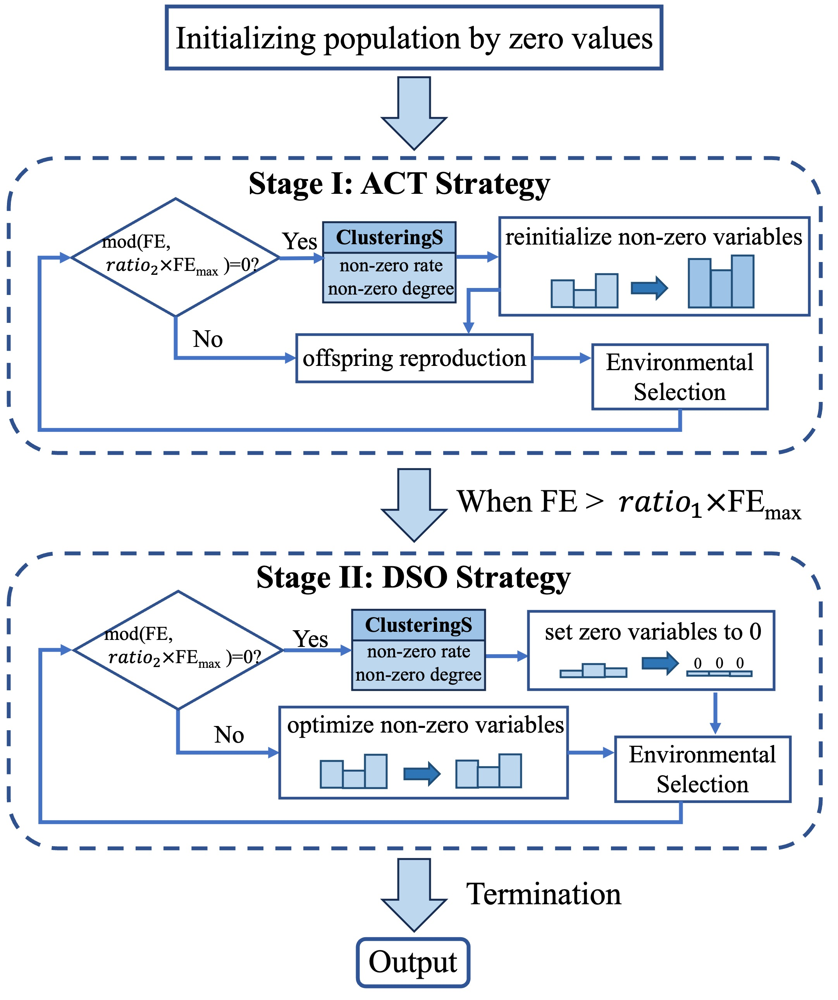

# MOEA-NZD
[Paper Link](https://ieeexplore.ieee.org/abstract/document/10605095)

This MATLAB code is written by the [PlatEMO](https://github.com/BIMK/PlatEMO) framework.

MOEA-NZD proposes a new perpective in solving ***sparse large-scale multi-objective*** optimization problems by highlighting the impact of 'non-zero' rather than 'zero' decision variables, which makes it achieve good performance effectively.

This code is from the paper 'Sparse Large-Scale Multiobjective Optimization by Identifying Nonzero Decision Variables', published in 'IEEE TRANSACTIONS ON SYSTEMS, MAN, AND CYBERNETICS: SYSTEMS'

## General framework

## Matlab Version

Required by PlatEMO

## Installation

Users can add this code into the 'PlatEMO/Algorithms/Multi-objective optimization'. 

## Contact

Xiangyu Wang: [xiangyu.wang@uni-bielefeld.de](xiangyu.wang@uni-bielefeld.de) or [xiangyu_wang1216@163.com](xiangyu_wang1216@163.com)
-[Google Scholars](https://scholar.google.com.hk/citations?user=bWW6MRsAAAAJ&hl=zh-CN)

